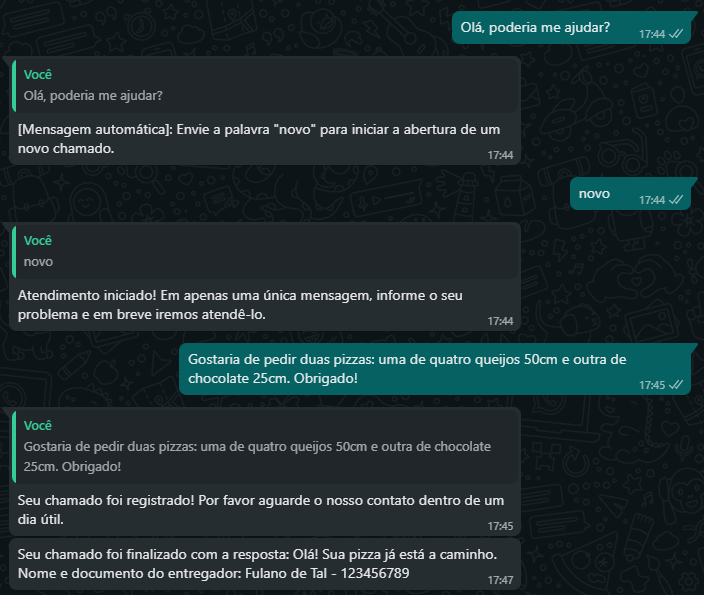
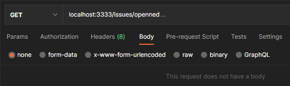
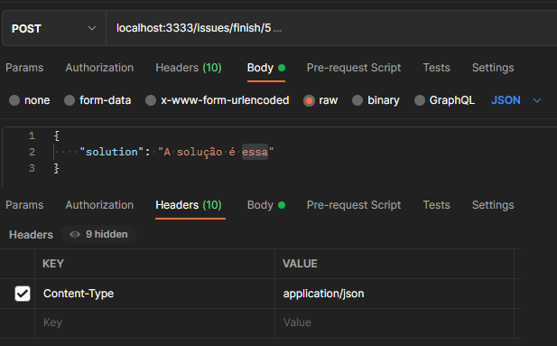
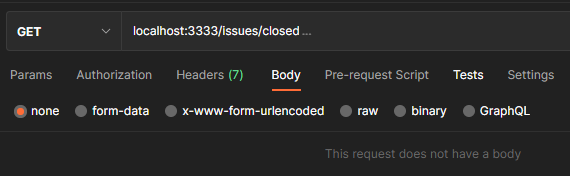

<div align="center">
  <h1> Helpdesk Whatsapp Bot 🤖📱 </h1>
</div>

<p align="center">
  

  
</p>



## 🎮 O Projeto

Projeto de estudo criado para colocar em prática o conhecimento obtido com NodeJS através de um projeto pessoal.

É uma API de suporte onde o cliente abre o chamado via WhatsApp e quando tem a sua solicitação atendida, recebe uma resposta pelo mesmo meio de contato.

## 🧪 Technologies

Este projeto utiliza as seguintes tecnologias:

- [NodeJS](https://nodejs.org/)
- [TypeScript](https://www.typescriptlang.org/)
- [TypeORM](https://typeorm.io/)
- [Whatsapp Web](https://github.com/pedroslopez/whatsapp-web.js)

## ⚠️🤚 Andes de começar, leia com atenção 👈
API criada com base no seguinte projeto: https://github.com/pedroslopez/whatsapp-web.js.

O mesmo informa que esta não é uma API oficial do WhatsApp e o número que você utilizar para testes poderá ser bloqueado pelo WhatsApp. Esteja ciente desse risco. Recomendo ler cuidadosamente as documentações disponibilizadas:
- https://github.com/pedroslopez/whatsapp-web.js
- https://guide.wwebjs.dev/
- https://docs.wwebjs.dev/

Para o meu aprendizado, fiz o uso de um número adquirido só para a realização desse projeto.

## 🚀 Instalação

- Requer Node versão 12 ou superior.

```bash
$ git clone https://github.com/gonribeiro/Helpdesk-Whatsapp-Bot # Clone o projeto
$ cd Helpdesk-Whatsapp-Bot # Acesse a pasta
$ yarn install # Instale
$ yarn typeorm migration:run # Construa o banco de dados
$ yarn start # Inicie o projeto
```
- O aplicativo estará disponível na porta 3333.

- Ao iniciar pela primeira vez, no terminal da inicialização, aparecerá um QRCODE que você deve escaneá-lo pelo WhatsApp (Da mesma forma que faz no WhatsApp Web - se você estiver conectado no WhatsApp Web, será desconectado).
- Uma vez conectado, através do terminal, aparecerá a seguinte mensagem: "Server runnig on port 3333" e "Client is ready!".
- A partir desse momento o número do WhatsApp utilizado se tornará um bot 🤖.

OBS: Sempre aguarde aparecer "Client is ready!" até mesmo quando você modificar o projeto. Somente neste momento o bot estará funcionando e responderá as suas interações.

## Rotas API disponíves

As rotas são de uso exclusivo do atendente do chamado (porque o solicitante interage apenas pelo WhatsApp).

O projeto não possui telas. Realize os exemplos utilizando o Postman, Insomnia ou qualquer outro de sua preferência.

|  Método |  Rota  | Parâmetros | Retorno |
|---------|--------|------------| ------- |
|   GET   | /issues/opened | nenhum | Chamados Abertos
|  POST   | /issue/finish/:id | `number` id | Chamado Concluído
|   GET   | /issues/closed | nenhum | Chamados Fechados

## Exemplos de requisições

- Listar chamados abertos:



- Finalizar chamado:



- Listar chamados fechados:



## Notas do aprendizado: Iniciando com NodeJS
Iniciando / Instalando:
```
$ yarn init -y
$ yarn add express typeorm reflect-metadata sqlite3 whatsapp-web.js qrcode-terminal express-async-errors @types/express -D typescript -D ts-node-dev -D
$ yarn tsc --init
```
tsconfig.json:
```
strict: false
...
"experimentalDecorators": true, # descomentar:
"emitDecoratorMetadata": true, # descomentar:
```
package.json:
```
"license": "MIT",
"scripts": {
    "dev": "ts-node-dev src/server.ts",
    "typeorm": "ts-node-dev node_modules/typeorm/cli.js"
},
```
Na raiz do projeto, crie: ormconfig.json e dentro de src a pasta database.

...

Após criar as entidades...

...
```
$ yarn typeorm migration:run
```